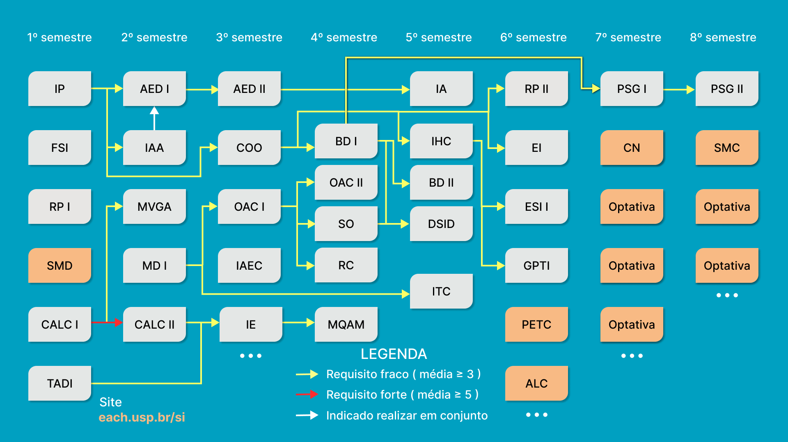

<!--- Variables section --->

[ACH2001]: https://uspdigital.usp.br/jupiterweb/obterDisciplina?sgldis=ACH2001
[ACH2014]: https://uspdigital.usp.br/jupiterweb/obterDisciplina?sgldis=ACH2014
[ACH0021]: https://uspdigital.usp.br/jupiterweb/obterDisciplina?sgldis=ACH0021
[ACH0041]: https://uspdigital.usp.br/jupiterweb/obterDisciplina?sgldis=ACH0041
[ACH2011]: https://uspdigital.usp.br/jupiterweb/obterDisciplina?sgldis=ACH2011
[ACH0141]: https://uspdigital.usp.br/jupiterweb/obterDisciplina?sgldis=ACH0141
[ACH0151]: https://uspdigital.usp.br/jupiterweb/obterDisciplina?sgldis=ACH0151
[ACH0161]: https://uspdigital.usp.br/jupiterweb/obterDisciplina?sgldis=ACH0161
[ACH2002]: https://uspdigital.usp.br/jupiterweb/obterDisciplina?sgldis=ACH2002
[ACH2012]: https://uspdigital.usp.br/jupiterweb/obterDisciplina?sgldis=ACH2012
[ACH2013]: https://uspdigital.usp.br/jupiterweb/obterDisciplina?sgldis=ACH2013
[ACH2023]: https://uspdigital.usp.br/jupiterweb/obterDisciplina?sgldis=ACH2023
[ACH2033]: https://uspdigital.usp.br/jupiterweb/obterDisciplina?sgldis=ACH2033
[ACH2003]: https://uspdigital.usp.br/jupiterweb/obterDisciplina?sgldis=ACH2003
[ACH2024]: https://uspdigital.usp.br/jupiterweb/obterDisciplina?sgldis=ACH2024
[ACH2034]: https://uspdigital.usp.br/jupiterweb/obterDisciplina?sgldis=ACH2034
[ACH2063]: https://uspdigital.usp.br/jupiterweb/obterDisciplina?sgldis=ACH2063
[ACH2053]: https://uspdigital.usp.br/jupiterweb/obterDisciplina?sgldis=ACH2053
[ACH2004]: https://uspdigital.usp.br/jupiterweb/obterDisciplina?sgldis=ACH2004
[ACH2036]: https://uspdigital.usp.br/jupiterweb/obterDisciplina?sgldis=ACH2036
[ACH2055]: https://uspdigital.usp.br/jupiterweb/obterDisciplina?sgldis=ACH2055
[ACH2026]: https://uspdigital.usp.br/jupiterweb/obterDisciplina?sgldis=ACH2026
[ACH2044]: https://uspdigital.usp.br/jupiterweb/obterDisciplina?sgldis=ACH2044
[ACH2005]: https://uspdigital.usp.br/jupiterweb/obterDisciplina?sgldis=ACH2005
[ACH2016]: https://uspdigital.usp.br/jupiterweb/obterDisciplina?sgldis=ACH2016
[ACH2025]: https://uspdigital.usp.br/jupiterweb/obterDisciplina?sgldis=ACH2025
[ACH2043]: https://uspdigital.usp.br/jupiterweb/obterDisciplina?sgldis=ACH2043
[ACH2147]: https://uspdigital.usp.br/jupiterweb/obterDisciplina?sgldis=ACH2147
[ACH2006]: https://uspdigital.usp.br/jupiterweb/obterDisciplina?sgldis=ACH2006
[ACH0042]: https://uspdigital.usp.br/jupiterweb/obterDisciplina?sgldis=ACH0042
[ACH2027]: https://uspdigital.usp.br/jupiterweb/obterDisciplina?sgldis=ACH2027
[ACH2008]: https://uspdigital.usp.br/jupiterweb/obterDisciplina?sgldis=ACH2008
[ACH0102]: https://uspdigital.usp.br/jupiterweb/obterDisciplina?sgldis=ACH0102
[ACH0112]: https://uspdigital.usp.br/jupiterweb/obterDisciplina?sgldis=ACH0112
[ACH0122]: https://uspdigital.usp.br/jupiterweb/obterDisciplina?sgldis=ACH0122
[ACH0132]: https://uspdigital.usp.br/jupiterweb/obterDisciplina?sgldis=ACH0132
[ACH0162]: https://uspdigital.usp.br/jupiterweb/obterDisciplina?sgldis=ACH0162
[ACH0172]: https://uspdigital.usp.br/jupiterweb/obterDisciplina?sgldis=ACH0172
[ACH0182]: https://uspdigital.usp.br/jupiterweb/obterDisciplina?sgldis=ACH0182
[ACH0192]: https://uspdigital.usp.br/jupiterweb/obterDisciplina?sgldis=ACH0192
[ACH2017]: https://uspdigital.usp.br/jupiterweb/obterDisciplina?sgldis=ACH2017
[ACH0101]: https://uspdigital.usp.br/jupiterweb/obterDisciplina?sgldis=ACH0101
[ACH0111]: https://uspdigital.usp.br/jupiterweb/obterDisciplina?sgldis=ACH0111
[ACH0121]: https://uspdigital.usp.br/jupiterweb/obterDisciplina?sgldis=ACH0121
[ACH0131]: https://uspdigital.usp.br/jupiterweb/obterDisciplina?sgldis=ACH0131
[ACH2018]: https://uspdigital.usp.br/jupiterweb/obterDisciplina?sgldis=ACH2018
[ACH0142]: https://uspdigital.usp.br/jupiterweb/obterDisciplina?sgldis=ACH0142
[ACH0152]: https://uspdigital.usp.br/jupiterweb/obterDisciplina?sgldis=ACH0152

# Information Systems Course work

This repo stores all the work I've done during my undergraduate course of Information Systems at the University of São Paulo (USP).

Source of the schedule: https://www.each.usp.br/si/assets/html/subjects.html

Course informations source: https://uspdigital.usp.br/jupiterweb/listarGradeCurricular?codcg=86&codcur=86200&codhab=204&tipo=N

## 1st Year

### 1st Semester

- [ACH2001]: [Introdução à Programação (IP)](1Sem/IP) ✅
- [ACH2014]: [Fundamentos de Sistemas de Informação (FSI)](1Sem/FSI) ✅
- [ACH0021]: [Tratamento e Análise de Dados/ Informações (TADI)](1Sem/TADI) ✅
- [ACH0041]: [Resolução de Problemas I (RP I)](1Sem/RP1) ✅
- [ACH2011]: [Cálculo I (CALC I)](1Sem/CALC1) ✅

#### Elective Subjects

- [ACH0141]: Sociedade, Multiculturalismo e Direitos - Estado e Sociedade (SMD)
- [ACH0151]: Sociedade, Multiculturalismo e Direitos - Cultura Digital (SMD)
- [ACH0161]: [Sociedade, Multiculturalismo e Direitos - Direitos Humanos e Multiculturalismo (SMD)](1Sem/SMD) ✅

### 2nd Semester

- [ACH2002]: [Introdução à Análise de Algoritmos (IAA)](2Sem/IAA) ✅
- [ACH2012]: [Cálculo II (CALC II)](2Sem/CALC2) ⚠️
- [ACH2013]: [Matemática Discreta (MD)](2Sem/MD) ✅
- [ACH2023]: [Algoritmos e Estruturas de Dados I (AED I)](2Sem/AED) ✅
- [ACH2033]: [Matrizes, Vetores e Geometria Analítica (MVGA)](2Sem/MVGA) ✅

## 2nd Year

### 3rd Semester

- [ACH2003]: [Computação Orientada a Objetos (COO)](3Sem/COO)
- [ACH2024]: [Algoritmos e Estruturas de Dados II (AED II)](3Sem/AED2)
- [ACH2034]: [Organização e Arquitetura de Computadores (OAC I)](3Sem/OAC1)
- [ACH2063]: [Introdução à Administração e Economia para Computação (IAEC)](3Sem/IAEC)
- [ACH2053]: [Introdução à Estatística (IE)](3Sem/IE)

### 4th Semester

- [ACH2004]: [Banco de Dados I (BD I)](4Sem/BD1)
- [ACH2036]: [Métodos Quantitativos para Análise Multivariada](4Sem/MQA)
- [ACH2055]: [Organização e Arquitetura de Computadores (OAC II)](4Sem/OAC2)
- [ACH2026]: [Redes de Computadores (RC)](4Sem/RC)
- [ACH2044]: [Sistemas Operacionais (SO)](4Sem/SO)

## 3rd Year

### 5th Semester

- [ACH2005]: [Análise, Projeto e Interface Humano-Computador (IHC)](5Sem/IHC)
- [ACH2016]: [Inteligência Artificial (IA)](5Sem/IA)
- [ACH2025]: [Banco de Dados II (BD II)](5Sem/BD2)
- [ACH2043]: [Introdução à Teoria da Computação (ITC)](5Sem/ITC)
- [ACH2147]: [Desenvolvimento de Sistemas de Informação Distribuídos (DSID)](5Sem/DSID)

### 6th Semester

- [ACH2006]: [Engenharia de Sistemas de Informação (ESI)](6Sem/ESI)
- [ACH0042]: [Resolução de Problemas II (RP II)](6Sem/RP2)
- [ACH2027]: [Gestão de Projetos de Tecnologia da Informação (GPTI)](6Sem/GPTI)
- [ACH2008]: [Empreendedorismo em Informática (EI)](6Sem/EI)

#### Elective Subjects

- [ACH0102]: Psicologia, Educação e Temas Contemporâneos (PETC)
- [ACH0112]: Psicologia, Educação e Temas Contemporâneos - Uma Visão Psicanalítica (PETC)
- [ACH0122]: Psicologia, Educação e Temas Contemporâneos - Processos Sociais de Formação dos Indivíduos (PETC)
- [ACH0132]: Psicologia, Educação e Temas Contemporâneos - Uma Abordagem Crítica (PETC)
- [ACH0162]: Arte, Literatura e Cultura (ALC)
- [ACH0172]: Arte, Literatura e Cultura – Arte Contemporânea (ALC)
- [ACH0182]: Arte, Literatura e Cultura – Fantasia e Ficção Científica na Cultura Pop (ALC)
- [ACH0192]: Arte, Literatura e Cultura – Literatura Contemporânea (ALC)

## 4th Year

### 7th Semester

- [ACH2017]: [Projeto Supervisionado ou de Graduação I (PSG I)](7Sem/PSG1)

#### Elective Subjects

- [ACH0101]: Ciências da Natureza – Ciências da Terra (CN)
- [ACH0111]: Ciências da Natureza – Ciências da Vida (CN)
- [ACH0121]: Ciências da Natureza – Ciências do Universo (CN)
- [ACH0131]: Ciências da Natureza – Ciência, Cultura e Sociedade (CN)

### 8th Semester

- [ACH2018]: [Projeto Supervisionado ou de Graduação II (PSG II)](7Sem/PSG2)

#### Elective Subjects

- [ACH0142]: Sociedade, Meio Ambiente e Cidadania – Desenvolvimento e Meio Ambiente (SMC)
- [ACH0152]: Sociedade, Meio Ambiente e Cidadania – Sociedade, Ambiente e Cidadania (SMC)
